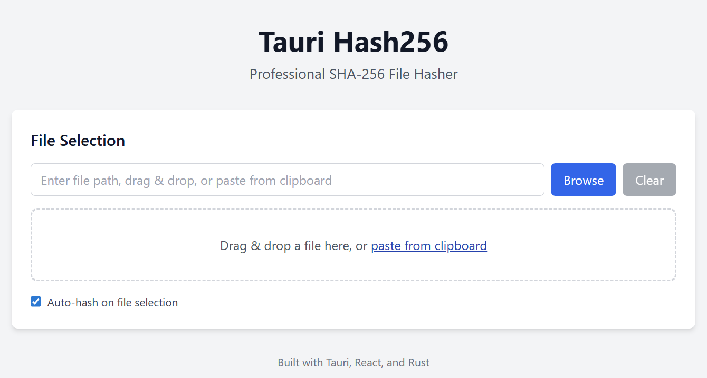

# Tauri Hash256

A professional desktop utility for computing SHA-256 hashes of files, built with Tauri for optimal performance and small binary size.

## Features

- **File Input Methods**: Drag-and-drop file hashing, browse dialog, path input with auto-completion
- **Live Progress Updates**: Real-time progress in window title as percentage during hashing
- **Cancellation Support**: Cancel button to stop hashing operations with proper state management
- **Hash Outputs**: Both HEX and Base64 formats with copy-to-clipboard functionality
- **Auto-Hash**: Automatic hashing when file is selected/pasted/browsed/dropped (configurable)
- **Professional Formatting**: File sizes, elapsed time, throughput with thousands separators
- **Cross-Platform**: Windows, macOS, and Linux support
- **Lightweight**: Single executable files without runtime dependencies

## Screenshots



## Technology Stack

- **Frontend**: React 18 + TypeScript + Vite + Tailwind CSS
- **Backend**: Rust + Tauri 2.x
- **Package Manager**: Bun
- **Build Tool**: Vite
- **Styling**: Tailwind CSS

## Prerequisites

- [Rust](https://rustup.rs/) (latest stable)
- [Bun](https://bun.sh/) (latest version)
- [Node.js](https://nodejs.org/) (18+ for development)

## Important: Domain Configuration

**⚠️ Before running the development server, you must configure your local domain:**

The application is configured to run on `tarui-hash.aceapp.dev` (note: there's a typo in the current config - should be `tauri-hash.aceapp.dev`). To use this domain locally:

1. **Add to hosts file** (`C:\Windows\System32\drivers\etc\hosts` on Windows):

   ```
   127.0.0.1 tarui-hash.aceapp.dev
   ```

2. **Or update the domain** in `vite.config.ts` to use `localhost` or your preferred local domain:
   ```typescript
   server: {
     host: 'localhost', // or your preferred domain
     port: 1420,
     // ...
   }
   ```

## Installation

### From Source

1. Clone the repository:

   ```bash
   git clone https://github.com/ropean/tauri-hash.git
   cd tauri-hash
   ```

2. Install dependencies:

   ```bash
   bun install
   ```

3. Run in development mode:

   ```bash
   bun run tauri:dev
   ```

4. Build for production:
   ```bash
   bun run tauri:build
   ```

## Development

### Available Scripts

- `bun run dev` - Start Vite dev server
- `bun run build` - Build frontend for production
- `bun run tauri:dev` - Start Tauri development mode
- `bun run tauri:build` - Build Tauri application for production
- `bun run preview` - Preview production build

### Project Structure

```
tauri-hash/
├── src/                      # Frontend (React/TypeScript)
│   ├── App.tsx               # Main application component
│   ├── components/           # Reusable UI components
│   ├── hooks/                # Custom React hooks
│   ├── utils/                # Utility functions
│   └── types/                # TypeScript type definitions
├── src-tauri/                # Backend (Rust/Tauri)
│   ├── src/
│   │   ├── main.rs           # Application entry point
│   │   ├── commands.rs       # Tauri command handlers
│   │   ├── hash.rs           # SHA-256 computation logic
│   │   └── models.rs         # Data structures
│   ├── Cargo.toml            # Rust dependencies
│   └── tauri.conf.json       # Tauri configuration
├── assets/                   # Application icons
└── .github/workflows/        # CI/CD pipeline
```

## Architecture

### Frontend (React)

The frontend is built with React 18 and TypeScript, providing a modern and responsive user interface. Key components include:

- **FileInput**: Handles file selection, drag & drop, and path input
- **ProgressBar**: Displays real-time hashing progress
- **HashOutput**: Shows hash results and file metadata
- **Custom Hooks**: `useHash` for hash operations, `useSettings` for app preferences

### Backend (Rust)

The Rust backend provides high-performance SHA-256 computation with:

- **Streaming**: 4MB buffer chunks for memory efficiency
- **Progress Reporting**: Real-time updates via Tauri events
- **Cancellation**: Cooperative cancellation with proper cleanup
- **Error Handling**: Comprehensive error types and user-friendly messages

### Tauri Integration

Tauri provides the bridge between the web frontend and native backend, offering:

- **Secure APIs**: Sandboxed file system access
- **Cross-Platform**: Native binaries for Windows, macOS, and Linux
- **Performance**: Minimal overhead compared to Electron
- **Bundle Size**: Small executable files without runtime dependencies

## Usage

1. **Select a File**: Use the browse button, drag & drop, or paste a file path
2. **Auto-Hash**: Files are automatically hashed when selected (configurable)
3. **Monitor Progress**: Watch real-time progress in the window title and progress bar
4. **View Results**: See both HEX and Base64 hash outputs with copy buttons
5. **File Metadata**: View file size, processing time, and throughput information

## Configuration

### Settings

- **Auto-Hash**: Automatically compute hash when file is selected
- **Uppercase HEX**: Toggle between uppercase and lowercase hexadecimal output

### Window Settings

- **Size**: 900x700 pixels (resizable)
- **Position**: Centered on screen
- **Minimum Size**: 800x600 pixels

## Building

### Development Build

```bash
bun run tauri:dev
```

### Production Build

```bash
bun run tauri:build
```

This creates optimized binaries for all target platforms in `src-tauri/target/release/`.

## Distribution

The application is distributed as single executable files for each platform:

- **Windows**: `.exe` file
- **macOS**: `.app` bundle
- **Linux**: ELF binary

### CI/CD Pipeline

GitHub Actions automatically builds and releases the application when tags are pushed:

1. **Matrix Build**: Builds for Windows, macOS, and Linux
2. **Artifact Upload**: Uploads build artifacts
3. **Release Creation**: Creates GitHub release with all binaries

## Performance

- **Memory Usage**: Efficient 4MB buffer streaming
- **Processing Speed**: Native Rust performance
- **Binary Size**: Minimal executable size without dependencies
- **Startup Time**: Fast application launch

## Security

- **Sandboxed Access**: Tauri's secure file system APIs
- **Input Validation**: Comprehensive path and file validation
- **Error Handling**: Secure error messages without information leakage

## Contributing

1. Fork the repository
2. Create a feature branch
3. Make your changes
4. Add tests if applicable
5. Submit a pull request

## License

This project is licensed under the MIT License - see the [LICENSE](LICENSE) file for details.

## Acknowledgments

- [Tauri](https://tauri.app/) - Framework for building desktop applications
- [React](https://reactjs.org/) - Frontend library
- [Rust](https://rust-lang.org/) - Systems programming language
- [Tailwind CSS](https://tailwindcss.com/) - Utility-first CSS framework

## Support

For support and questions:

- [GitHub Issues](https://github.com/ropean/tauri-hash/issues)
- [Discussions](https://github.com/ropean/tauri-hash/discussions)

## Roadmap

- [ ] Multiple hash algorithms (SHA-1, SHA-512, BLAKE3)
- [ ] Batch file processing
- [ ] Hash verification against known checksums
- [ ] Settings persistence
- [ ] File integrity monitoring
- [ ] Export results to file
- [ ] Portable mode
- [ ] Command-line interface
- [ ] Plugin system
